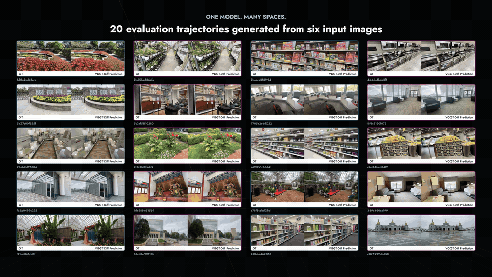

<div align="center">

# VGGT-Diff

### Visual Geometry Meets Diffusion for Sparse-View Novel View Synthesis

Kangjie Chen<sup>1*</sup>&nbsp;&nbsp; Xiangyu Li<sup>1*</sup>&nbsp;&nbsp; Dongbin Zhang<sup>1</sup>&nbsp;&nbsp; Chaodao Zheng<sup>1</sup>&nbsp;&nbsp; Shijia Chen<sup>1</sup><br>
Jinhao Deng<sup>1</sup>&nbsp;&nbsp; Hongbin Lin<sup>2</sup>&nbsp;&nbsp; Choo Sin Wai<sup>3</sup>&nbsp;&nbsp; Minqi Wang<sup>2</sup>&nbsp;&nbsp; Minghao Yang<sup>3</sup><br>
Dake Zhong<sup>3</sup>&nbsp;&nbsp; Guorui Song<sup>3</sup>&nbsp;&nbsp; Yu Zhang<sup>1</sup>&nbsp;&nbsp; Xianming Liu<sup>1</sup>&nbsp;&nbsp; Boyang Wang<sup>1&dagger;</sup>

<sup>1</sup> XPeng Motors&nbsp;&nbsp;&nbsp; <sup>2</sup> The Chinese University of Hong Kong&nbsp;&nbsp;&nbsp; <sup>3</sup> Tsinghua University

[](https://chenkangjie1123.github.io/VGGT-Diff/)
[](https://chenkangjie1123.github.io/VGGT-Diff/VGGT-Diff.pdf)




</div>

## Updates

- **September 27, 2026:** We released the VGGT-Diff [paper](https://chenkangjie1123.github.io/VGGT-Diff/VGGT-Diff.pdf), [project page](https://chenkangjie1123.github.io/VGGT-Diff/), and code.

## TODO

- [ ] Release half-resolution and full-resolution VGGT-Diff checkpoints.
- [ ] Release the full-resolution checkpoint for continuous camera-trajectory generation.

## Overview

VGGT-Diff combines geometry-routed visual evidence from VGGT-Omega with a pretrained video diffusion prior. Given six sparse-view images, it jointly synthesizes a camera-controlled novel-view sequence while preserving observed structure and completing unseen content.

This release contains the main training and inference paths, six-view visual conditioning, per-frame camera-trajectory conditioning, and a ready-to-run garden example. Model checkpoints are not stored in this repository and will be released separately.

## Installation

```bash
git clone https://github.com/chenkangjie1123/VGGT-Diff.git
cd VGGT-Diff

conda create -n vggtdiff python=3.10 -y
conda activate vggtdiff
pip install -e .
pip install git+https://github.com/facebookresearch/vggt-omega.git@399d4d62935deb71cedb1e1c35b7a90413a6bee4
```

Request access to the [VGGT-Omega checkpoint](https://huggingface.co/facebook/VGGT-Omega) and download `vggt_omega_1b_512.pt`. Wan2.1 weights are downloaded automatically on first use, or can be supplied through `--base-model-dir`.

## Inference

The default example includes six source views and an 80-frame camera trajectory:

```bash
python scripts/infer.py \
  --checkpoint /path/to/vggtdiff.safetensors \
  --omega-checkpoint /path/to/vggt_omega_1b_512.pt
```

The generated frames and video are written to `outputs/garden/`. Full-resolution inference is enabled with `--height 480 --width 832`; the lower default resolution is convenient for a first run.

### Custom scenes

Create a directory with this layout:

```text
my_scene/
├── source_views/
│   ├── 00.png
│   ├── 01.png
│   └── ...
└── trajectory.json
```

`trajectory.json` contains `source_w2c`, `target_w2c`, `source_intrinsics`, and `target_intrinsics`. Extrinsics use world-to-camera matrices in OpenCV convention; intrinsics are 3x3 pixel-space matrices at the source image resolution.

```bash
python scripts/infer.py \
  --checkpoint /path/to/vggtdiff.safetensors \
  --omega-checkpoint /path/to/vggt_omega_1b_512.pt \
  --example /path/to/my_scene \
  --output outputs/my_scene
```

## Training

Training scenes follow the folder-form DL3DV convention:

```text
dataset_root/
└── scene_id/
    ├── images_4/
    └── transforms.json
```

First cache the frozen VGGT-Omega source features:

```bash
python scripts/prepare_omega_cache.py \
  --dataset-root /path/to/dataset_root \
  --cache-root /path/to/omega_cache \
  --omega-checkpoint /path/to/vggt_omega_1b_512.pt
```

Then launch full-model fine-tuning with Accelerate:

```bash
accelerate launch scripts/train.py \
  --dataset-root /path/to/dataset_root \
  --omega-cache /path/to/omega_cache \
  --resume /path/to/vggtdiff.safetensors \
  --output outputs/training_run
```

The default training protocol uses six source views, 80 contiguous targets, causal 4:1 target VAE compression, temporally packed per-frame Plucker conditioning, source-anchor camera normalization, and the point-track residual consistency loss.

## Citation

```bibtex
@misc{chen2026vggtdiff,
  title={Visual Geometry Meets Diffusion for Sparse-View Novel View Synthesis},
  author={Chen, Kangjie and Li, Xiangyu and Zhang, Dongbin and Zheng, Chaodao and Chen, Shijia and Deng, Jinhao and Lin, Hongbin and Wai, Choo Sin and Wang, Minqi and Yang, Minghao and Zhong, Dake and Song, Guorui and Zhang, Yu and Liu, Xianming and Wang, Boyang},
  year={2026},
  url={https://chenkangjie1123.github.io/VGGT-Diff/}
}
```

## Acknowledgements

This project builds on [Wan2.1](https://github.com/Wan-Video/Wan2.1), [VGGT-Omega](https://github.com/facebookresearch/vggt-omega), [FrameCrafter](https://github.com/szqwu/FrameCrafter), and [DiffSynth-Studio](https://github.com/modelscope/DiffSynth-Studio). We thank their authors for releasing their work.

## License

VGGT-Diff is released under the [VGGT-Diff Research License](LICENSE) for non-commercial research and educational use. Third-party components and dependencies remain subject to their respective licenses and terms; see [NOTICE](NOTICE).
